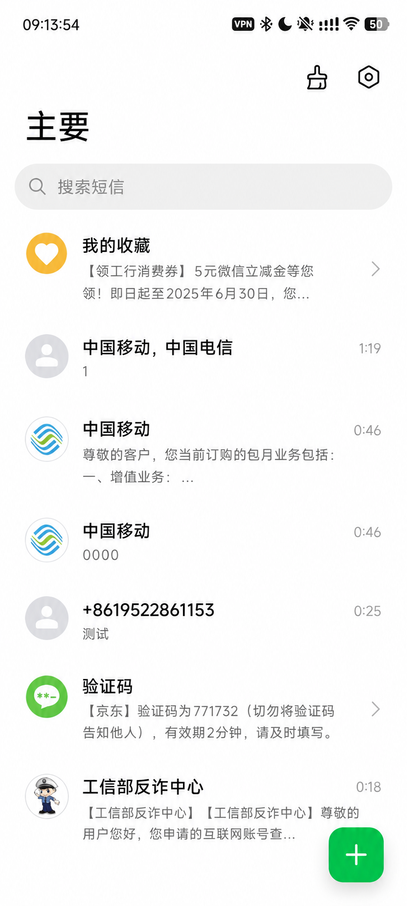

# SMS Forwarder · Android 默认短信与多渠道转发

<p align="center">
  
</p>

<p align="center">
  基于 Fossify Messages 二次开发，面向华为 EMUI / HarmonyOS 4.x 与标准 Android 设备的开源短信客户端。
</p>

<p align="center">
  <a href="https://github.com/2756826865/sms-forwarder-huawei">项目地址</a>
  ·
  <a href="https://github.com/2756826865/sms-forwarder-huawei/releases/latest">下载最新版</a>
  ·
  <a href="https://github.com/2756826865/sms-forwarder-huawei/issues">问题反馈</a>
  ·
  <a href="CUSTOM_BUILD.md">构建说明</a>
</p>

> 本项目是独立维护的 GPL-3.0 开源分支，不是 Fossify 官方版本，也不隶属于华为、小米、PushPlus 或任何运营商、消息平台。

## 项目信息

| 项目 | 内容 |
|---|---|
| 项目地址 | <https://github.com/2756826865/sms-forwarder-huawei> |
| 当前版本 | `1.0.1` |
| versionCode | `1008` |
| 正式包名 | `com.helyu.smsforwarder` |
| 最低系统 | Android 8.0 / API 26 |
| targetSdk / compileSdk | API 36 |
| 开源许可 | GPL-3.0 |
| 上游项目 | [Fossify Messages](https://github.com/FossifyOrg/Messages) |

## 项目定位

SMS Forwarder 既是可设置为系统默认应用的短信客户端，也是本地运行的短信转发工具。它能够完成短信收发、会话管理、双卡选择、批量发送和定时发送，并把新短信转发到用户自行配置的第三方渠道。

当前重点适配仍能安装 Android APK 的华为 EMUI / HarmonyOS 4.x。项目同时使用 Android 标准短信、通知、默认应用和后台任务接口，兼容小米 MIUI / HyperOS 及其他 Android 系统；不同厂商的后台限制可能导致实际表现不同。

<p align="center">
  
</p>

## 功能清单

### 短信客户端

- 会话列表、全文搜索、单条会话查看与回复。
- 新建短信支持联系人和手动号码，例如 `10086`、`10000`。
- 系统短信通知、未读状态、标为已读、置顶、删除和多选操作。
- 通讯录名称与头像读取；无头像时显示统一默认头像。
- 双卡发送与接收，显示 SIM1/SIM2，并可手动填写卡名称和本机号码。
- 系统短信库重新同步与遗漏短信补偿同步。

### 发送能力

- 普通短信发送。
- 批量选择联系人或手动录入多个号码。
- 批量发送间隔支持立即、1、2、3、4、5 秒。
- 定时发送，按系统精确闹钟能力执行。

### 短信转发

| 渠道 | 配置内容 | 典型用途 |
|---|---|---|
| PushPlus | Token | 微信公众号接收个人通知 |
| 钉钉群机器人 | Webhook、可选签名密钥 | 钉钉群通知 |
| 飞书群机器人 | Webhook、可选签名密钥 | 飞书群通知 |
| 企业微信应用消息 | Corp ID、Agent ID、Secret、接收对象 | 企业内部消息 |
| 电子邮箱 | SMTP SSL 主机、端口、账号、授权码、收件人 | 邮件归档和跨设备接收 |

转发页面提供免责声明。只有用户主动同意、配置并启用渠道后，应用才会向对应第三方服务发送短信内容。转发模板支持自定义 SIM 显示名称、号码和消息排版。

### 后台可靠性

- `SMS_DELIVER` 到达后立即交给串行前台服务处理。
- 使用部分唤醒锁完成息屏下的解析、系统短信库入库、通知和转发入队。
- 系统短信库写入失败时进行短间隔重试，成功后才保存去重记录。
- 使用 WorkManager 保存并重试网络转发任务。
- 开机、解锁、回到前台和定期任务触发补偿同步。
- 提供自启动、电池优化、通知权限和厂商后台设置入口。

核心接收流程：

```text
SMS_DELIVER
  → SmsReceiver
  → IncomingSmsService
  → 写入系统短信库
  → 更新本地会话
  → 生成系统通知
  → 转发任务入队
  → 成功发送或后台重试
```

## 安装与首次设置

1. 从 [Releases](https://github.com/2756826865/sms-forwarder-huawei/releases) 下载正式 APK。
2. 安装后按系统提示将本应用设置为默认短信应用。
3. 允许短信、电话状态、联系人和通知权限。
4. 进入“设置 → 后台运行与系统兼容”。
5. 开启自启动、后台活动，取消电池优化，并允许锁屏通知。
6. 检查 Android SMS Role、底层短信路由和 WRITE_SMS 是否全部正常。
7. 如需转发，进入“短信转发功能”，阅读免责声明并配置渠道。
8. 用另一部手机分别向 SIM1、SIM2 发送测试短信，验证会话、通知和转发。

## 华为 / HarmonyOS 默认短信状态分裂

### 现象

部分 HarmonyOS 4.x 设备在系统界面中已经选择本应用为默认短信应用，但三个底层状态并不一致：

| 检查项 | 正常值 |
|---|---|
| Android SMS Role | `com.helyu.smsforwarder` |
| `sms_default_application` | `com.helyu.smsforwarder` |
| WRITE_SMS AppOp | `allow` |

现场测试确认，HarmonyOS 可能只切换 Android SMS Role 并授予 WRITE_SMS，却仍把 `sms_default_application` 保留为 `com.android.mms`。此时界面看似切换成功，底层短信投递仍可能异常。

### 为什么应用不能自动修复

Android 10–16 应通过 `RoleManager.ROLE_SMS` 请求默认短信角色，并由用户在系统弹窗中确认。普通 APK 无权静默修改 `Settings.Secure` 或 AppOps。旧的 `ACTION_CHANGE_DEFAULT` 从 Android 10 起不再是可靠方案，在已测试的 HarmonyOS 4.x 设备上也无法同步底层路由。

因此，应用只负责准确检测、显示问题并提供修复命令，不会绕过系统权限自动修改安全设置。

### ADB 修复

连接电脑并确认 `adb devices` 显示设备状态为 `device`，然后执行：

```cmd
adb shell settings --user 0 put secure sms_default_application com.helyu.smsforwarder
adb shell appops set com.helyu.smsforwarder WRITE_SMS allow
```

如果页面已经显示 `WRITE_SMS：允许`，通常只需要第一条命令：

```cmd
adb shell settings --user 0 put secure sms_default_application com.helyu.smsforwarder
```

复查：

```cmd
adb shell settings --user 0 get secure sms_default_application
adb shell dumpsys role | findstr /i "android.app.role.SMS smsforwarder com.android.mms"
adb shell appops get com.helyu.smsforwarder WRITE_SMS
```

Windows PowerShell 若提示找不到 `adb`，请在 platform-tools 目录使用 `./adb` 或 `.\adb`。

### 恢复华为“信息”

先在系统默认应用中重新选择华为“信息”，必要时执行：

```cmd
adb shell settings --user 0 put secure sms_default_application com.android.mms
adb shell appops set com.android.mms WRITE_SMS allow
```

重新安装应用、切换默认短信应用或系统更新后，HarmonyOS 可能再次出现状态分裂。遇到收不到短信时，应先进入兼容页面重新检测。

## 华为与小米后台设置

### 华为 / 荣耀

- “应用启动管理”关闭自动管理。
- 开启自启动、关联启动和后台活动。
- 电池优化设为允许后台运行或不限制。
- 开启锁屏通知和横幅通知。
- 如系统提供“休眠时始终保持网络连接”，建议开启。

### 小米 / Redmi / POCO

- 开启自启动。
- 省电策略设为无限制。
- 允许后台弹出界面、通知和锁屏显示。
- 在任务界面锁定应用可进一步降低被清理概率。

系统设置只能改善厂商后台限制；短信是否真正投递，还应以兼容页面显示的三项短信状态为准。

## 隐私、安全与使用责任

- 本项目本身不提供云端短信服务，不建立开发者控制的短信数据库。
- 转发凭据保存在设备本地；启用转发后，短信内容会发送至用户配置的第三方平台。
- 短信可能包含验证码、账单、身份信息等敏感内容，请勿转发到多人群聊或不可信服务。
- 请妥善保管 Token、Webhook、Secret、SMTP 授权码和签名文件，提交 Issue 时不要上传这些内容。
- 批量发送会产生运营商资费，也可能触发运营商限制。请遵守当地法律、运营商规则和接收方意愿。
- 禁止将本项目用于未经授权的监控、信息窃取、骚扰发送或其他违法用途。

## 下载、签名与升级

正式 APK 请从 [GitHub Releases](https://github.com/2756826865/sms-forwarder-huawei/releases) 下载。

正式签名证书 SHA-256：

```text
227d5ed7b74462e37d6e88c424eb0aad58a33acb1b6e193f2e2d08a650107c96
```

只要包名和签名证书保持一致，后续版本可以直接覆盖升级。Debug 包使用不同签名；从 Debug 迁移到正式版时，通常需要先卸载 Debug 包。

## 本地构建

环境要求：

- JDK 17
- Android SDK 36
- 可访问 Google Maven 与 Maven Central

```bash
git clone https://github.com/2756826865/sms-forwarder-huawei.git
cd sms-forwarder-huawei
./gradlew :app:assembleCoreDebug
```

Debug APK 输出目录：

```text
app/build/outputs/apk/core/debug/
```

## GitHub Actions 签名构建

正式版通过 `.github/workflows/build-custom-apk.yml` 构建。签名文件和密码只能放入 GitHub Actions Secrets，不得提交到仓库。

流水线负责：

1. 配置 JDK 和 Android 构建环境。
2. 编译 Release APK。
3. 执行 R8 与资源裁剪。
4. 使用 Secrets 注入的正式证书签名。
5. 验证 APK 包名、版本和签名。
6. 扫描并阻止包含 Fossify 假版本警告文本的产物上传。
7. 上传可下载的构建产物。

完整的 Secrets 名称、Codex 接手提示、签名验证和真机回归命令见 [CODEX-RUN.md](CODEX-RUN.md) 与 [CUSTOM_BUILD.md](CUSTOM_BUILD.md)。

## 真机回归清单

每次发布前至少验证：

- [ ] 安装或覆盖升级无签名冲突。
- [ ] 版本号和包名正确。
- [ ] Android SMS Role、底层短信路由、WRITE_SMS 全部正常。
- [ ] 亮屏接收、入库、会话刷新、通知、回复正常。
- [ ] 息屏接收、入库、锁屏通知、转发正常。
- [ ] 每条短信只通知一次、只转发一次。
- [ ] SIM1/SIM2 接收、显示和发送选择正确。
- [ ] PushPlus 和已启用的其他渠道测试成功。
- [ ] 断网后任务保留，恢复联网后能够重试。
- [ ] 重启、解锁和应用重新进入前台后会话无遗漏。
- [ ] 批量发送间隔和定时发送符合设置。
- [ ] “项目地址”、关于页仓库和酷安主页可以打开。
- [ ] 不再出现 Fossify “fake version” 英文警告。

## 已知限制

- 华为 EMUI / HarmonyOS 可能出现默认短信状态分裂，普通 APK 无法静默修复。
- 厂商后台策略可能延迟网络转发；必须允许自启动、后台活动并取消电池优化。
- 部分运营商不会向 Android 提供 SIM 本机号码，需要用户手动填写。
- 大量历史短信首次同步受设备性能和短信数量影响，可能需要数分钟。
- 定时发送的准点程度受精确闹钟权限、SIM 状态、系统调度和运营商网络影响。
- 第三方转发渠道的可用性、限流和隐私策略由对应平台决定。

## 问题反馈

请在 [GitHub Issues](https://github.com/2756826865/sms-forwarder-huawei/issues) 提供：

- 手机品牌与型号。
- Android、EMUI、HarmonyOS、MIUI 或 HyperOS 版本。
- 应用版本号。
- 三项默认短信状态。
- 亮屏或息屏场景。
- 可复现步骤和已脱敏日志。

请勿提交真实短信内容、手机号码、验证码、Token、Webhook、Secret、邮箱密码、签名文件或签名密码。

## 开源许可与致谢

本项目基于 [Fossify Messages](https://github.com/FossifyOrg/Messages) 二次开发，并依据 [GNU General Public License v3.0](LICENSE) 开源。公开分发修改版时，必须继续提供对应源代码并遵守 GPL-3.0。

第三方组件及许可信息可在应用“关于 → 第三方许可”中查看。感谢 Fossify 社区及所有相关开源项目贡献者。
